name:begin
class: center, middle

# Une monnaie libre
# pour une société libre

#### Libre currency, libre society

---
### Plan

- Problèmes sociétaux, environnementaux et économiques
- Monnaies non-libres : monnaies dette, Bitcoin et altcoin
- Résumé types de monnaie
- Théorie relative de la monnaie et Monnaie libre
- Blockchain, Réseau Duniter, Toile de confiance
- Nœud Duniter, Remuniter
- Logiciels client : Sakia, Césium, Silkaj
- Monnaie libre Ğ1
- Comment rejoindre Ğ1 ?
- Ğannonce
- Dixième Rencontre de la Monnaie Libre
- Ğeconomicus, ateliers TRM
- Comment contribuer ?

[- Liens utiles]: #
[- Questions]: #
[- Crédits]: #

---

#### Problèmes sociétaux, environnementaux et économiques

##### Ce qui se développe
- Développement des solutions logiciels privatrices
- Agriculture industrielle, monoculture, pauvre en nutriments
- Changement climatique
- Grande disparité des richesses
- Société du Travail, emploi, chômage
- vols, suicides, guerres

##### Ce qui pène à se développer
- Le monde du logiciel libre
- Internet Libre et décentralisé : FFDN, YunoHost, La Brique Internet
- Agriculture paysanne, permaculture, AMAP, semences libres
- Économie de la contribution
- La monnaie libre, Ğ1

---
class: center, middle

### Monnaies non-libres


---

### Monnaie dette
- Création monétaire (des unités de monnaies) basée sur l’endettement d’une personne envers une autre 
- Plus de 2 000 ans que ça existe
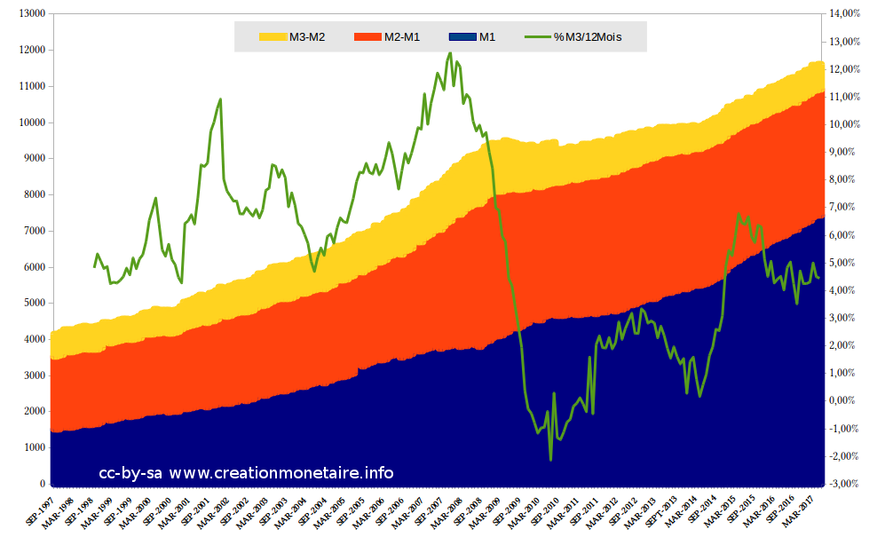

---

### Bitcoin et Altcoin
- Décentralisé, P2P
- Création monétaire asymétrique dans :
    - l’espace : seul les mineurs créent de la monnaie
    - le temps : principalement les premiers créent de la monnaie

---

class: center, middle
### Théorie Relative de la Monnaie
- Publiée en 2010

---
class: center

### Symétrie spatiale
- Tout membre est créateur du dividende universel (DU, ~RdB)
- L’espace économique sont les membres humains de la monnaie

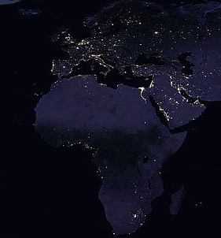

---
class: center

### Symétrie spatiale
- Évolution d’un compte membre :

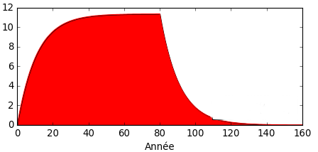

---
class: center

### Symétrie temporelle
Croissance de la masse monétaire qui ne privilégie ni les plus jeunes ni les moins jeunes devant la création monétaire

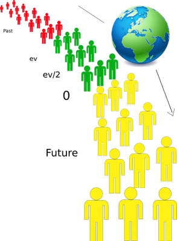

---

### Symétrie temporelle
- c = ln(ev/2)/(ev/2) avec ev = 80 ans => c = +10 %/an
- Réévaluation du DU : DU(t + 1) = c × DU(t)
- Car c’est pas pareil de rajouter 10 unités dans 100 que dans 1 000 unités

---

### Résumé types de monnaies

| Propriétés | Monnaie-dette | Alt-coin | Monnaie libre |
| :-- | :--: | :--: | :--: |
| Réseau décentralisée | ✘ | ✔ | ✔ |
| Code informatique libre | ✘ | ✔ | ✔ |
| Code monétaire transparent | ✘ | ✔ | ✔ |
| Symétrie spatiale | ✘ | ✘ | ✔ |
| Symétrie temporelle | ✘ | ✘ | ✔ |
| Total | 0/5 | 3/5 | 5/5 |

---

### Réseau Duniter
- Basé sur la blockchain et la preuve de travail personnalisée
- Architecture nœuds-clients du réseau Duniter
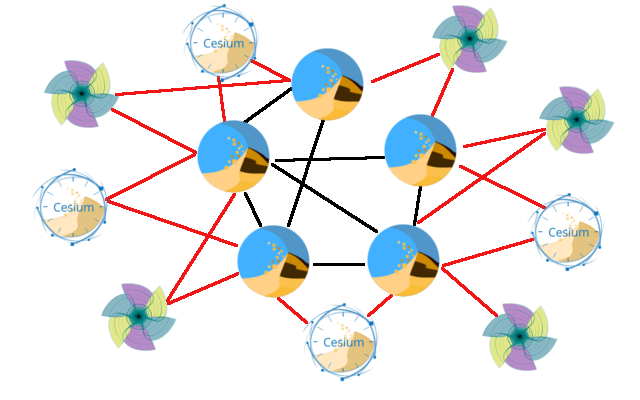

---

### Toile de confiance
- Identification unique des membres
- Création individuelle des dividendes universels
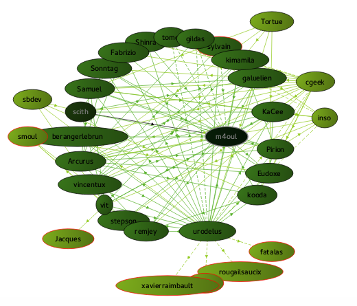

---

### Nœud Duniter
- [Duniter](https://github.com/duniter/duniter) : nœud/serveur, Node.js, JavaScript, C++
- Interface web

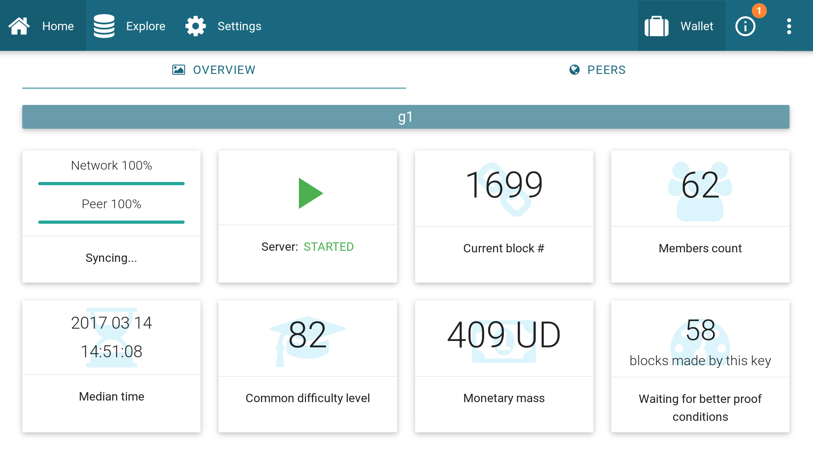


---

### Nœud Duniter

- Interface en ligne de commande

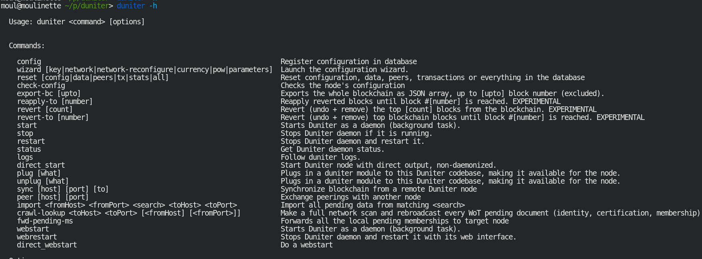


---

### Remuniter
- Rémunération des générateurs de blocs

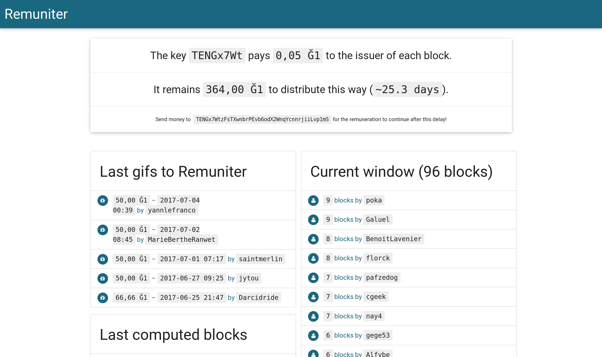

---

### Sakia

- [sakia-wallet.org](http://sakia-wallet.org)
- Client lourd Qt5/Python3

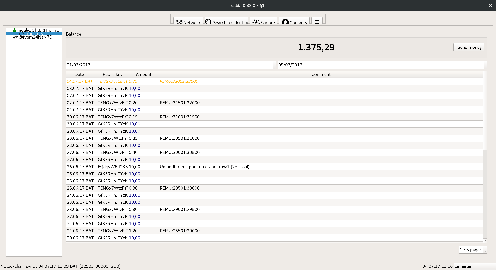

---

### Césium

- [github.com/duniter/cesium](https://github.com/duniter/cesium)
- Client léger web, AngularJS, JavaScript
- Via un site web, installation locale avec WebKit et sur mobile

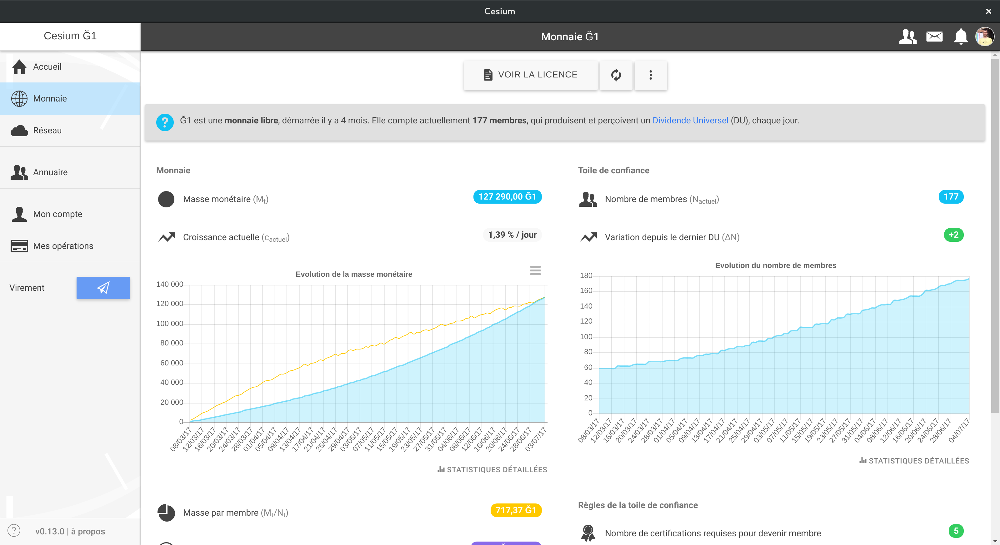

---

### Silkaj

- [silkaj.duniter.org](https://silkaj.duniter.org)
- Client en ligne de commande écrit en Python3

```bash
silkaj transaction --auth-scrypt --amount=20 \
--output=GfKERHnJTYzKhKUma5h1uWhetbA8yHKymhVH2raf2aCP \
--comment="Thanks for the RMLL conference"
Please enter your Scrypt Salt (Secret identifier): *******
Please enter your Scrypt password (masked): ********
╒════════════════╤══════════════════════════════════════════════╕
│ amount (g1)    │ 20.0                                         │
├────────────────┼──────────────────────────────────────────────┤
│ amount (DU g1) │ 2.0                                          │
├────────────────┼──────────────────────────────────────────────┤
│ from           │ 3rp7ahDGeXqffBQTnENiXEFXYS7BRjYmS33NbgfCuDc8 │
├────────────────┼──────────────────────────────────────────────┤
│ to             │ GfKERHnJTYzKhKUma5h1uWhetbA8yHKymhVH2raf2aCP │
├────────────────┼──────────────────────────────────────────────┤
│ to (id)        │ moul                                         │
├────────────────┼──────────────────────────────────────────────┤
│ comment        │ Thanks for the RMLL conference               │
╘════════════════╧══════════════════════════════════════════════╛
Do you confirm sending this transaction? [yes/no]: 
```

---
class: center, middle

### Monnaie libre Ğ1


---

### Monnaie libre Ğ1
- Quatre ans de développement des logiciels
- Monnaie lancée le 8 mars 2017
- Depuis quatre mois
- Plus de 180 membres
- Rencontres, install party, jeux Ğeconomicus :
   - Toulouse
   - Montpellier
   - Rennes/Laval
   - Paris
   - Belgique
   - Lyon
   - Bordeaux
- [Carte des membres, activités, rencontres de Ğ1](https://framacarte.org/fr/map/duniter-g1_8702#6/47.294/2.670)

---

### Monnaie libre Ğ1

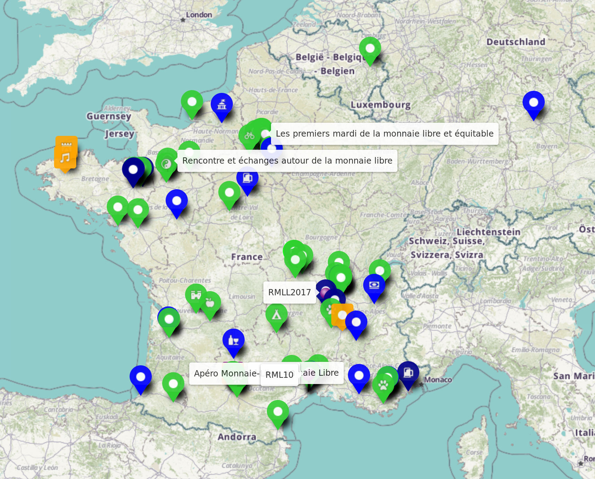

---

### Comment rejoindre Ğ1 ?

- En allant aux évènements organisés dans les lieux sus-cités
- Jouer au jeu Ğeconomicus
- Obtenir la certification de cinq membres
- En comprenant et en acceptant la [licence monétaire Ğ1](https://github.com/duniter/G1/tree/master/license)

---

### Ğannonce

- [Site de petites annonces en Ğ1](https://gannonce.duniter.org)

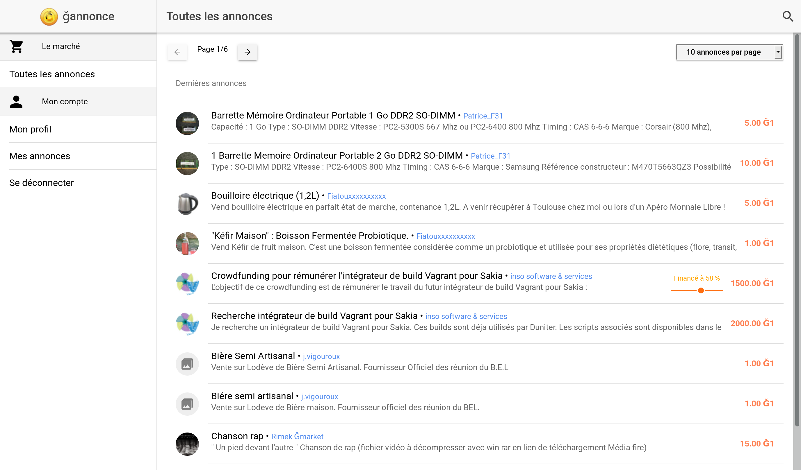

---

### 10ième Rencontre de la Monnaie Libre
- [rml10.duniter.org](https://rml10.duniter.org)
- Rencontre informatique de développement des logiciels Duniter
- Montpellier
- Du 23 au 26 novembre 2017
- Jeudi et vendredi : développement des clients et du nœud Duniter
- Samedi : jeu Ğeconomicus, ateliers TRM
- Dimanche : utilisation des logiciels

---

### Ğeconomicus
- [geconomicus.glibre.org](http://geconomicus.glibre.org)
- Jeu de prise de conscience que la création monétaire influe sur l’économie
- Simulations monnaie-dette et monnaie libre

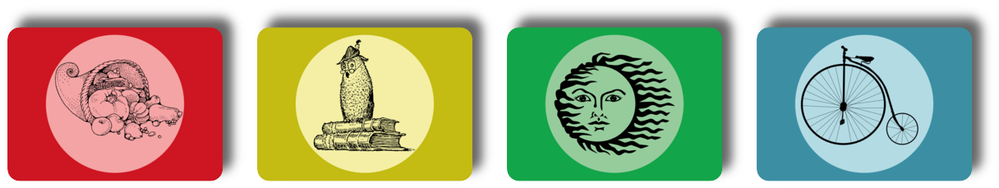

### Ateliers TRM
- Approfondissements de la théorie avec les modules Galilée, Yoland Bresson…

---

### Comment contribuer ?
- Comprendre la TRM et les concepts de la monnaie libre
- Organiser des Ğeconomicus, des install party
- Faire des conférences
- Devenir membre
- Proposer des biens et des services en monnaie libre Ğ1
- Avoir un nœud miroir ou membre qui calcule des blocs
- Contribuer au code des logiciels

---
name:links
### Liens utiles

- Site web et doc de Duniter : [duniter.org](https://duniter.org)
- Dépôts de développement : [github.com/duniter](https://github.com/duniter)
- Forums : [forum.duniter.org](https://forum.duniter.org), [forum.duniter.fr](https://forum.duniter.fr)
- Salon de discussion XMPP [chat.duniter.org](https://chat.duniter.org)
    - [xmpp:duniter@muc.duniter.org](xmpp:duniter@muc.duniter.org)
- Site web de Sakia : [sakia-wallet.org](http://sakia-wallet.org)
- Site web de Silkaj : [silkaj.duniter.org](https://silkaj.duniter.org)
- Théorie Relative de la Monnaie : [trm.creationmonetaire.info](http://trm.creationmonetaire.info)
- Relative Theory of Monney : [en.trm.creationmonetaire.info](http://en.trm.creationmonetaire.info)
- Ğeconomicus : [geconomicus.glibre.org](http://geconomicus.glibre.org)
- Rencontres de la Monnaie libre : [rml.creationmonetaire.info](http://rml.creationmonetaire.info)

---

#### Crédit

- Diaporama sous licence libre CC-BY-SA 4.0


- Sources du diaporama : [github.com/duniter/prez_rmll2017](https://github.com/duniter/prez_rmll2017)

#### Don
- Clé publique : GfKERHnJTYzKhKUma5h1uWhetbA8yHKymhVH2raf2aCP

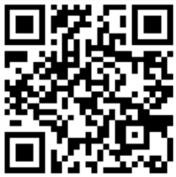

---
class: center, middle

## Merci

---

class: center, middle
## Questions ?

---
name: end
class: center, middle


